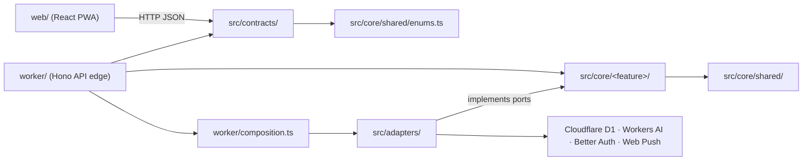
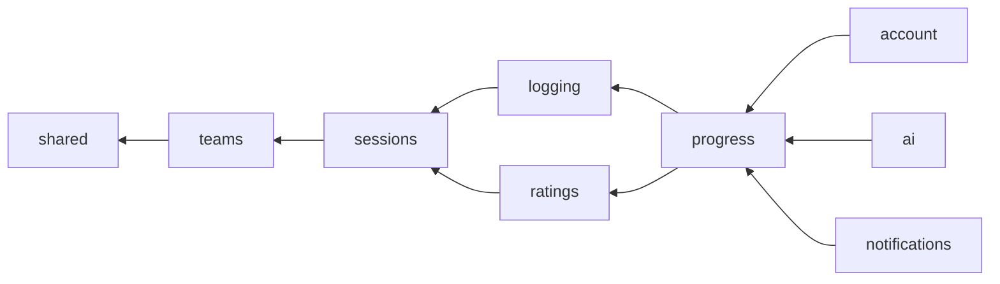
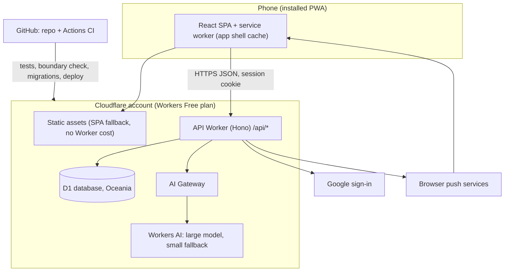
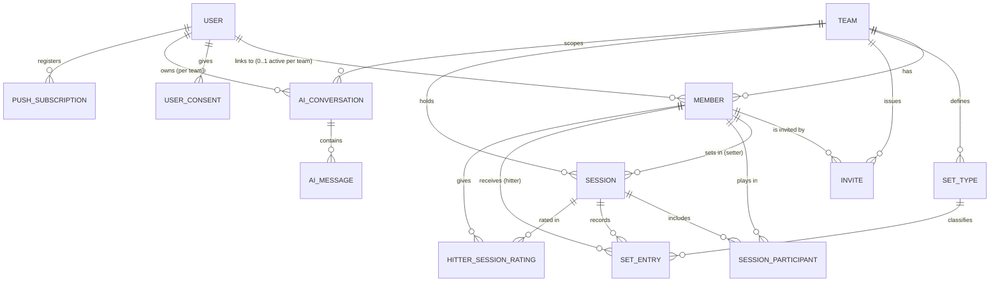

# Setter Diary — Architecture Document

## Design Paradigm

**Hexagonal (ports and adapters), organised by feature slices.** Each feature owns a pure **core** (domain model, use cases, authorization policy, port interfaces). **Adapters** implement ports against Cloudflare, Better Auth and other vendors. The **API Worker** (Hono) and the **SPA** (React) are delivery edges that call use cases; they hold no business rules.

| Layer | Location | May depend on |
| --- | --- | --- |
| Shared kernel | `src/core/shared/` | nothing outside itself |
| Feature core | `src/core/<feature>/` | shared kernel; the public `index.ts` of slices **below** it in the slice order (AD-2) |
| Contracts | `src/contracts/` | `src/core/shared/enums.ts` only |
| Adapters | `src/adapters/<port>/<vendor>/` | core ports; vendor SDKs |
| API edge | `worker/` | contracts; core use cases; adapters only in `worker/composition.ts` |
| Web app (PWA) | `web/` | `src/contracts/` only |



**Slice order** (a slice may use only slices to its left; enforced by dependency-cruiser):



Slices: `teams` (teams, members, flags, invites, set types, team settings), `sessions` (sessions, participants, positions), `logging` (set entries), `ratings` (hitter session ratings), `progress` (all stat aggregation and read models), `ai` (discussions, usage), `account` (consents, export, deletion), `notifications` (push). Future features (hitting stats, passing stats, coach role, video calibration) arrive as new slices placed in this order.

## Invariants & Rules

### AD-1 — Core is vendor-free [ADOPTED]

- **Binds:** all
- **Prevents:** Cloudflare, Hono, Drizzle, Better Auth or AI-provider APIs leaking into business logic, which would make moving hosts or providers a rewrite.
- **Rule:** Nothing under `src/core/` imports from `src/adapters/`, `worker/`, `web/`, or any vendor package (`hono`, `drizzle-orm`, `better-auth`, `cloudflare:*`, `@cloudflare/*`, AI SDKs). Core reaches the outside world only through port interfaces it declares. dependency-cruiser runs in CI and fails the build on any violation of this rule, the layer table or the slice order. CI also runs it against a fixture that deliberately breaks a boundary and must fail, so a check that silently parses nothing cannot pass.

### AD-2 — Slices own their tables, follow the slice order, and guard their children [ADOPTED]

- **Binds:** all
- **Prevents:** two slices writing one table, import cycles, and orphaned rows.
- **Rule:** Every table has exactly one owning slice, and only that slice's adapters write it:

  | Owner | Tables |
  | --- | --- |
  | teams | `teams` (incl. time zone, `former_seq`), `members`, `invites`, `set_types` |
  | sessions | `sessions`, `session_participants` |
  | logging | `set_entries` |
  | ratings | `hitter_session_ratings` |
  | ai | `ai_conversations`, `ai_messages`, `ai_usage_daily`, `ai_user_usage` |
  | account | `user_consents` |
  | notifications | `push_subscriptions`, `notification_log` |
  | identity adapter | Better Auth tables (`schema/identity.ts`) |

  A slice uses another slice only through that slice's `index.ts`, and only in the slice order above. A lower slice that needs something from a higher one (for example sessions asking logging whether entries exist) declares a port that the higher slice implements, wired in `composition.ts`. The owner of a parent row guards its dependents: sessions refuses to remove a participant who has set entries or a rating (`409 PARTICIPANT_HAS_DATA`). Foreign keys are `ON DELETE RESTRICT`; nothing cascades.

### AD-3 — One PWA and one API Worker on Cloudflare [ADOPTED]

- **Binds:** all; FR-1 to FR-17
- **Prevents:** extra backends, server-side page rendering, or native builds that break the free plan or fragment the code.
- **Rule:** The product is a single installable PWA (React + Vite) served as Cloudflare static assets, with SPA fallback, so screen loads never invoke the Worker. All data and logic go through one Hono API Worker under `/api/*`; the assets config sets `run_worker_first: ["/api/*"]`, and the service worker sets `navigateFallbackDenylist: [/^\/api\//]`, so browser navigations to `/api/*` (such as the Google sign-in callback) always reach the Worker. No server-side rendering. A native store wrapper is a later add-on around the same PWA, never a separate app.

### AD-4 — Every request, row and reference is team-scoped [ADOPTED]

- **Binds:** FR-10, FR-11, FR-13, FR-16; all team data
- **Prevents:** one team's data leaking to another, and each feature inventing its own way to pick a team.
- **Rule:**
  - **Rows:** every team-owned table has a non-null `team_id` and `UNIQUE(team_id, id)`. Every reference to another team-owned row is a composite foreign key `(team_id, x_id)`, so the database refuses mixed-team rows.
  - **Team routes:** `/api/teams/:teamId/<slice>/...`. The edge builds `TeamScope { teamId, member }` from the path and the session user, and returns `403 NOT_A_MEMBER` before any use case runs if the user has no active member there. Repository ports for team data require a `TeamScope`.
  - **User routes:** `/api/me/...` receive `UserScope { userId, memberships[] }`. They reach team data only by iterating memberships and calling the TeamScope API; no port takes a `userId` for team data.
  - **System work** (push sending, deletion steps) uses an explicit `SystemScope`, created only in `worker/composition.ts`; port methods accepting it are named `*AsSystem`.
  - Each slice tests a cross-team read, a cross-team write and a mixed-team reference, and expects all three to fail.

### AD-5 — Authorization is server-side; visibility has one source [ADOPTED]

- **Binds:** FR-1, FR-2, FR-3, FR-6, FR-8, FR-9, FR-11, FR-14, FR-17; `permissions-matrix.md`
- **Prevents:** slices deciding differently who sees what, and access enforced only in the UI.
- **Rule:**
  - Each slice has one `policy.ts`; use cases call it before acting; anything not explicitly allowed is refused. The web app may hide controls but never decides access.
  - **Visibility** is computed only by `src/core/teams/visibility.ts` (exported via `teams/index.ts`): `diaryAccess(actor, setterMemberId) → 'full' | 'own_rows' | 'trend_only' | 'none'` and `canSeeHitter(actor, hitterMemberId)`. The setter themself and `hasTeamView` holders get `full`; any other active member gets `trend_only` for trends and `own_rows` for grids, entries and ratings, decided by **row identity** (`member_id = actor.memberId`), never by the `isHitter` flag; non-members get `none`. Row restrictions are applied inside the query, never by filtering fetched results. AI conversations are outside this function and always owner-only (AD-10). `visibility.test.ts` encodes every row of `permissions-matrix.md`.
  - **Flags** on a member: `isSetter`, `isHitter`, `isManager`, `hasTeamView`, all set by managers. New members default to `isHitter = true`, others false; the team creator gets `isSetter = true, isManager = true`. Only `isSetter` members create sessions. Any active participant can be logged to and can rate. A demotion or removal that would leave a team with no manager is refused with a conditional update (`409 LAST_MANAGER`).

### AD-6 — Member is separate from user account [ADOPTED]

- **Binds:** FR-2, FR-10, FR-12, FR-15, FR-16, FR-17
- **Prevents:** stats being lost or orphaned when a player hasn't signed up, is removed, leaves, or deletes their account; and lists disagreeing about who is on the team.
- **Rule:**
  - A **member** is a person in one team: display name, flags, `status: active | removed`, optional `user_id`, and `former_user_id`. All stats reference `member_id`, never `user_id`. A user account links to zero or more members, at most one active member per team.
  - Accepting an invite sets `user_id`. Removing or leaving sets `removed_at`, moves `user_id` to `former_user_id` and clears `user_id`, in one write. Members are never hard-deleted; re-adding a removed person reactivates the same member row.
  - teams exports exactly two member lists: `listSelectableMembers(scope)` (active only, for pickers) and `getMembers(scope, ids)` (including removed and anonymised, for any historical display).

### AD-7 — Account deletion anonymises, never cascades into stats [ADOPTED]

- **Binds:** FR-12, FR-14
- **Prevents:** deleting team history, keeping identifiable data after deletion, or a half-deleted account.
- **Rule:** Deleting account U is one unit of work (AD-18):
  - every member where `user_id = U` or `former_user_id = U` is renamed "Former player N" (N from the team's `former_seq`, incremented in the same batch) and both columns are nulled;
  - U's consents, push subscriptions and AI conversations are deleted;
  - U's Better Auth rows are deleted last; the user carries `deletion_pending_at` until the whole operation completes, and the operation is idempotent and retried until then.
  - Every statement is set-based (`WHERE user_id = ?`), never one per row, so the operation stays within the D1 Free limit of 50 queries per request.

  Set entries and ratings are never deleted by account deletion.

### AD-8 — One table per stat type, keyed to session and member [ADOPTED]

- **Binds:** FR-4, FR-5, FR-6, FR-7, FR-8; future hitting and passing stats
- **Prevents:** a schemaless generic stats table, or new stats reshaping existing ones.
- **Rule:** Each kind of stat gets its own typed table owned by its slice: v1 has `set_entries` (one row per counted set) and `hitter_session_ratings` (one per hitter per session). Every stat row carries `team_id`, `session_id` and `member_id` references. A future stat type adds a new slice and table; it never adds columns to another slice's table.

### AD-9 — Setter and hitter ratings never overwrite each other; the lock is derived [ADOPTED]

- **Binds:** FR-5, FR-6
- **Prevents:** a hitter's opinion replacing setter data, and features disagreeing about whether a rating is still open.
- **Rule:**
  - Setter per-set ratings live only in `set_entries`, written only by the session's setter. Hitter ratings live only in `hitter_session_ratings`, unique per (session, hitter), written only by that hitter; each row holds a frequency (`never | rarely | sometimes | mostly`) for each rating 0–3, at least one above `never`. Any single-number summary is derived in progress (AD-17).
  - A member may rate session S when they are an active participant of S and not its setter.
  - The lock is **derived on read, never stored**: S's rating is locked once sessions' `nextSessionWith(scope, setterId, hitterId, after: S)` returns a session, ordered by `(session_date, created_at, id)`.
  - The "To rate" list is computed only by ratings and served from `GET /api/me/ratings/pending` (across the user's teams via `UserScope`). Web and notifications consume it and never compute it.

### AD-10 — All AI goes through one free, capped AI gateway [ADOPTED]

- **Binds:** FR-14; RFC-001
- **Prevents:** features calling AI providers directly, surprise AI spend, teammates' names reaching a model or surviving in transcripts, and inconsistent quota counting.
- **Rule:**
  - Only the `ai` slice's `AiGateway` port calls a model, through its adapter (Cloudflare Workers AI on the Workers Free plan, via Cloudflare AI Gateway). Allowed providers must not train on our data. Never switches to a paid plan automatically.
  - **Models:** exact Workers AI model IDs are configuration (`AI_MODEL_PRIMARY`, `AI_MODEL_FALLBACK`), chosen by a quality bake-off on a real stats summary among current, non-deprecated models (candidates: Gemma 4 26B, GLM 4.7-Flash, gpt-oss-20b/120b, Llama 3.3 70B fp8-fast). The fallback is the cheaper model; the model fallback is implemented in the adapter, not by AI Gateway. AI Gateway request and response body logging is turned off.
  - **Input:** built by `progress` (AD-17) with an `excludeMembers` set: members without recorded AI consent stay inside the setter's aggregate totals but never appear as a per-hitter row or label. Member names are replaced by labels ("Hitter A"). The requesting setter must hold AI consent (`CONSENT_REQUIRED`).
  - **Storage:** `ai_conversations` carry `team_id`, `owner_user_id` and `member_id`; reading requires `owner_user_id = session user` and the current TeamScope's team. Messages are stored **with labels** plus a per-conversation `label → member_id` map; names are restored only when displayed, via `teams.getMembers`. No member name is persisted outside `members`. Leaving a team deletes that user's conversations for that team.
  - **Quota:** a discussion is a new conversation; follow-ups are capped at `AI_MAX_TURNS` per conversation. Limit:pass quality `good | ok | poor`; rating `0 | 1 | 2 | 3`; frequency `never | rarely | sometimes | mostly`;new discussions per **user** per UTC day across teams, counted with a conditional `UPDATE ... WHERE count < limit` before the model call and refunded on provider error. App-wide usage is one `ai_usage_daily` row of estimated neurons; the gateway reads it to fall back from the large to the small model, then returns `limit_app`. Results are typed `{ status: 'ok' | 'limit_user' | 'limit_app' }`, not errors.

### AD-11 — Identity is an adapter; v1 is passwordless [ADOPTED]

- **Binds:** FR-1, FR-15, FR-16
- **Prevents:** sign-in details spreading through the app, password hashing exceeding the free plan's CPU limit, and untestable or improvised sign-in in previews.
- **Rule:**
  - Core knows only an opaque `userId`, from an `Identity` port. The adapter is Better Auth on D1 (with `@better-auth/passkey`): users, sessions, Google sign-in and passkeys only. Passkey-only users get a synthetic, non-routable email (`<userId>@users.invalid`) that is never shown or used. Session reads use Better Auth's cookie cache. Fitting Better Auth inside the 10 ms CPU limit is [ASSUMPTION] until the first story measures it in Workers Logs. Teams, members, flags and invites belong to the `teams` slice. No passwords in v1. Lost access is recovered by a manager-issued recovery invite (AD-12).
  - Consents (18+, privacy policy, AI processing) are stored with timestamps in the app-owned `user_consents` table (owner: account), written by the post-sign-up use case and read only via `account.getConsents(userIds)`.
  - The passkey relying-party ID and the Google OAuth redirect host are per-environment configuration. Preview and local environments use an `Identity` test adapter (`DEV_LOGIN=true`), which refuses to start when `ENV=production`.
  - Sessions use httpOnly, Secure, SameSite=Lax cookies.

### AD-12 — Invites are single-use links bound to a member [ADOPTED]

- **Binds:** FR-2, FR-15, FR-17
- **Prevents:** reusable or guessable join links, account takeover through a seen link, and duplicate members.
- **Rule:**
  - A manager adding or re-inviting a member creates a random token (stored hashed) bound to that member, with `kind: 'join' | 'recovery'` and an expiry (configuration, default 7 days). Re-issuing invalidates earlier tokens for that member.
  - `GET /api/invites/:token/preview` (no sign-in) shows the team and sets an httpOnly `invite` cookie; after sign-in, `POST /api/me/invites/redeem` reads it.
  - Redeem refuses when consents are missing (`CONSENT_REQUIRED`), when the account already has an active member in that team (`ALREADY_IN_TEAM`), or when the member is already linked and the token is not a `recovery` token (`MEMBER_ALREADY_LINKED`). Redemption and linking are one conditional write (`WHERE used_at IS NULL AND expires_at > now`).
  - Invites are shared as links; v1 sends no email.

### AD-13 — Stay inside the free plan; degrade, don't bill [ADOPTED]

- **Binds:** all
- **Prevents:** a feature that only works on paid plans, silently incurs cost, or lets bots exhaust the free allowances.
- **Rule:** Every feature must run on Workers Free limits (100k requests per day, 10 ms CPU and 50 subrequests per request; D1 Free: 500 MB per database, 50 queries per request, 5M rows read and 100k written per day; Workers AI 10,000 neurons per day). Edge middleware maps platform limit errors to `503 SERVICE_BUSY` with retry copy; nothing changes plan automatically. Unauthenticated entry points (team creation, invite preview) are protected by Cloudflare Turnstile and one Cloudflare rate-limiting rule [ASSUMPTION]. Any requirement needing a paid plan or a purchased resource (domain, Apple developer account) is raised as an RFC first.

### AD-14 — Data is always live; the shell updates itself [ADOPTED]

- **Binds:** FR-5, FR-7, FR-8, FR-9
- **Prevents:** stale stats, offline writes that need conflict handling, and old cached apps breaking against a newer API.
- **Rule:** The service worker caches static assets only (`registerType: 'autoUpdate'`, applied at the next navigation). API responses are never cached and no write is queued offline; without a connection the app shows a "no connection" state. Contract changes are additive for one release before removal. Every request sends `X-App-Version`; below the configured minimum the API returns `426 APP_UPDATE_REQUIRED` and the web app reloads.

### AD-15 — Time is UTC; weeks follow the team's time zone [ADOPTED]

- **Binds:** FR-4, FR-7, FR-8
- **Prevents:** sessions or trend weeks shifting by a day between users, SQL and the browser.
- **Rule:** Timestamps are stored as UTC ISO 8601. A session's `session_date` is a calendar date in the team's IANA time zone (team setting, default `Australia/Sydney`), and sessions also stores its ISO week `iso_week` (`YYYY-Www`, Monday start), computed once in `core/shared/time.ts` at write time. All grouping uses `iso_week`. In "before → now since D", before means `session_date < D` and now means `session_date >= D`. The default date for a new session ("today") comes from the API in the team time zone. Changing a team's time zone does not rewrite stored dates.

### AD-16 — Notifications go through one port and fire once [ADOPTED]

- **Binds:** FR-6
- **Prevents:** duplicate or missing pushes, and features depending on push for correctness.
- **Rule:** Only the `notifications` slice sends notifications, through a `Notifier` port (Web Push, VAPID keys as secrets). sessions publishes `ParticipantAdded` through a `DomainEvents` port after commit; notifications handles it in `ctx.waitUntil`, sends "rate today's sets" once per (session, participant) only if the participant is linked, and records it in `notification_log`. In-app "To rate" cards (AD-9) are the source of truth; a failed or missing push changes nothing.

### AD-17 — progress is the only place stats are aggregated [ADOPTED]

- **Binds:** FR-7, FR-8, FR-9, FR-11, FR-13, FR-14
- **Prevents:** each feature computing averages, hittable %, weeks or before → now its own way, and progress having no legal way to read the data.
- **Rule:** Tables are written only by their owner (AD-2). `progress` is a read-only query slice: its query adapter (`src/adapters/db/d1/queries/progress/`) may read other slices' tables, using only columns those slices declare public in `src/adapters/db/d1/schema/<slice>.public.ts`. Owners may add public columns freely; renaming or removing one needs a migration plan and an update to every reader. All aggregation (averages, % hittable, weekly buckets, before → now, AI input) is implemented once in progress; `ai`, `account` and `notifications` call progress or the owning slice's `index.ts` and never re-derive it. dependency-cruiser allows only the progress query adapter to import other slices' public schema files.

### AD-18 — Cross-slice writes use one unit of work [ADOPTED]

- **Binds:** FR-12; session deletion; participant changes
- **Prevents:** a multi-slice change running as several separate transactions and failing halfway.
- **Rule:** A use case that changes several slices' data uses a `UnitOfWork` port (shared kernel). Each owning slice exposes `prepare*` functions via `index.ts` that return deferred statements without executing them; the orchestrator submits them all as one D1 batch. Work that can't join the batch (Better Auth deletion) runs last, and the whole operation is idempotent and resumable. Deleting a session deletes its entries and ratings this way, never by cascade.

### AD-19 — Schema changes are linear, isolated and expand/contract [ADOPTED]

- **Binds:** all
- **Prevents:** parallel branches producing clashing migrations, previews breaking each other, and deploys breaking the running app.
- **Rule:** Migrations are generated only on a branch rebased onto `main`; CI fails if the drizzle-kit migration journal is not linear against `main`. Each pull request gets its own preview D1 database, created and seeded by CI and deleted when the PR closes. Production migrations are expand/contract: additive in one deploy, destructive only in a later deploy once no code reads the old shape.

### AD-20 — Referenced team data is archived, never hard-deleted [ADOPTED]

- **Binds:** FR-2, FR-3, FR-7, FR-8, FR-13
- **Prevents:** history disappearing or relabelling inconsistently when lists are edited.
- **Rule:** Set types are never hard-deleted: "delete" sets `archived_at`; archived types disappear from the tally grid but stay in progress, filters and export. A rename relabels all history; no slice copies set-type names or member names into its own rows. Display order is a `position` integer owned by teams. A new team's five default set types are created in the same batch as the team. Members follow AD-6.

### AD-21 — Tally logging is one idempotent request per tap [ADOPTED]

- **Binds:** FR-5
- **Prevents:** batched taps becoming an offline queue, double inserts on retry, and Undo and "−" removing different rows.
- **Rule:** Each tap sends one `POST /api/teams/:teamId/logging/entries` carrying a **client-generated UUIDv7** id, which is the idempotency key (the only client-generated id in the system). Undo deletes by that id. The selected-cell bar's "−" sends `DELETE .../entries/latest` with member, set type, pass and rating, which removes the newest matching row. Nothing is held client-side past a failed request.

### AD-22 — Export contains only what the user may already see [ADOPTED]

- **Binds:** FR-13
- **Prevents:** export exposing more than the permissions matrix allows.
- **Rule:** A user's export has one CSV per team membership, built through progress, logging and ratings `index.ts` functions under `UserScope`: (a) set entries where the user's member is the setter, (b) the hitter ratings the user gave, (c) sets received, aggregated exactly as the user's own grid row. Only the column layout is left to the stories.

## Consistency Conventions

| Concern | Convention |
| --- | --- |
| Naming | Slices and files `kebab-case`; TS types `PascalCase`, values `camelCase`; DB tables and columns `snake_case`, tables plural (`set_entries`) |
| API paths | `/api/teams/:teamId/<slice>/...` (TeamScope), `/api/me/...` (UserScope), `/api/auth/*` (identity), `/api/invites/:token/preview` (public); plural nouns |
| IDs | UUIDv7 strings, generated in core; the only exception is set entries (AD-21) |
| Dates and times | Stored UTC ISO 8601; `session_date` `YYYY-MM-DD` in team time zone; `iso_week` `YYYY-Www` (AD-15) |
| Enumerations | Lowercase string literals in `src/core/shared/enums.ts`: pass quality `good | ok | poor`; rating `0 | 1 | 2 | 3`; frequency `never | rarely | sometimes | mostly`;\| ok \| poor`; rating `0 \| 1 \| 2 \| 3`; session kind `game \| practice`; position `outside \| setter \| opposite \| middle \| libero` |
| Contracts | `src/contracts/common.ts` (ids, dates, enums, `MemberSummary`, errors) plus `src/contracts/<slice>.ts`. The slice that owns an entity owns its schema; others import it and never redefine it. Worker validates every input with these Zod schemas; web uses their types |
| Errors | `{ "error": { "code": "SNAKE_CASE", "message": "...", "details"?: ... } }`. Codes form one closed union in `src/contracts/errors.ts`, each with a fixed HTTP status; new codes are added there, never inline. Core returns typed results, not thrown strings |
| State mutation | Only use cases mutate state; single-slice multi-row writes use a D1 batch in that slice's adapter; cross-slice writes use the unit of work (AD-18) |
| Database changes | Drizzle schema per slice in `src/adapters/db/d1/schema/<slice>.ts` plus `<slice>.public.ts`; migrations by drizzle-kit, applied by CI (AD-19); never edit an applied migration |
| Auth on the API | Every `/api/*` route requires a session except `/api/auth/*` and invite preview; the edge builds the scope before calling a use case |
| Logging | Structured JSON lines with `requestId`; no names, emails or free-text notes |
| Config and secrets | Quotas, model names, `AI_MAX_TURNS`, invite expiry and minimum app version in `wrangler.jsonc` vars; keys (`BETTER_AUTH_SECRET`, Google client secret, VAPID private key) as Worker secrets; nothing secret in `web/` |
| Client data | Server state via TanStack Query keyed by `[slice, teamId, ...]`; no global client store in v1 [ASSUMPTION] |
| Styling | Design tokens from `design-system.md` as CSS custom properties in `web/styles/tokens.css`; components use CSS Modules; no CSS framework in v1 [ASSUMPTION] |
| Tests | Vitest. Core: plain unit tests. Adapters and API: run in the Workers runtime (`@cloudflare/vitest-pool-workers`) against local D1. Every slice tests its policy, cross-team isolation and mixed-team references; `visibility.test.ts` covers the permissions matrix. The `AiGateway` port is stubbed in tests; CI never calls Workers AI |
| Client routing | React Router in Data mode (`createBrowserRouter`), client-only; import from `react-router` |

## Stack

| Name | Version |
| --- | --- |
| TypeScript | 6.0.3 (TS 7 drops the compiler API that dependency-cruiser and typescript-eslint need; revisit when they support 7) |
| Node.js (local tooling and CI) | 24 LTS (React Router 8 needs ≥ 22.22) |
| Vite / @vitejs/plugin-react | 8.3 / 6.1 |
| React | 19.3 |
| React Router (Data mode, client-only) | 8.4 |
| TanStack Query | 5.104 |
| vite-plugin-pwa | 2.0 |
| Hono | 4.13 |
| Zod | 4.6 |
| Drizzle ORM / drizzle-kit | 0.45 / 0.31 |
| Better Auth / @better-auth/passkey | 1.7 / 1.7 |
| @pushforge/builder (Web Push) | 2.0 |
| Wrangler / @cloudflare/vite-plugin | 4.147 / 1.62 |
| Vitest / @cloudflare/vitest-pool-workers | 4.1 / 0.22 |
| dependency-cruiser | 18.5 |
| Cloudflare Workers (Free plan), D1, Workers AI, AI Gateway, Turnstile | managed platform |
| Starter | `npm create cloudflare@latest -- --template=cloudflare/templates/vite-react-template` |

## Structural Seed

### System and deployment



| Environment | Where | Data | Sign-in | Deploys |
| --- | --- | --- | --- | --- |
| Local | `vite dev` with the Cloudflare plugin | local D1 | dev login adapter | on save |
| Preview | Worker preview URL per pull request | own D1 per PR, seeded by CI | dev login adapter | each PR, by CI |
| Production | `*.workers.dev` until a domain is bought (see Deferred) | production D1 (created with `--location=oc`), Time Travel 7-day restore on Free | Google + passkeys | merge to `main`, by CI |

**Starter delta** (changes to the official `vite-react-template` in the first story): rename `wrangler.json` to `wrangler.jsonc`; move the SPA to `web/` and the Worker to `worker/` (update `main`, Vite root and tsconfig includes); add `run_worker_first: ["/api/*"]`; bump `compatibility_date`; upgrade Vite 7 → 8 with `@vitejs/plugin-react` 6; pin TypeScript 6.0.3 and add dependency-cruiser; add Node 24 to `.nvmrc` and CI.

### Operations

| Concern | Decision |
| --- | --- |
| Monitoring | Workers Logs (free) for errors and CPU time; AI Gateway analytics (under the Workers Logs regime for gateways created after 2026-09-24); Cloudflare usage notifications to the owner when Workers, D1 or Workers AI near daily limits |
| Rollback | The owner rolls back a bad deploy with `wrangler rollback`; schema changes are expand/contract (AD-19) so code rollback stays safe |
| Backup and restore | D1 Time Travel restores to any minute within 7 days (Free plan). A weekly GitHub Actions job also runs `wrangler d1 export` to a private, retention-limited artifact for older recovery. Restore steps live in the repo runbook |
| Sign-in setup | Google OAuth consent screen published "In production" with basic scopes (openid, email, profile); the workers.dev host checked as an authorised domain in the first story |
| Secrets | Rotated by the owner via `wrangler secret put`; rotating `BETTER_AUTH_SECRET` signs everyone out |
| Access | Only the owner holds Cloudflare and GitHub admin rights in v1 |

### Core data model



Better Auth's own tables (user, session, account, passkey, verification) sit behind the Identity adapter and are not referenced by core.

### Source tree

```text
setter-diary/
  web/                      # React PWA: routes, screens, components, styles/tokens.css
  worker/                   # Hono API edge: routes per slice, scope middleware, composition.ts
  src/
    contracts/              # common.ts, errors.ts, <slice>.ts Zod schemas
    core/
      shared/               # ids, time, enums, result types, scopes, UnitOfWork, DomainEvents
      teams/ sessions/ logging/ ratings/ progress/ ai/ account/ notifications/
                            # each: model.ts, policy.ts, ports.ts, use-cases/, index.ts
                            # teams also: visibility.ts, visibility.test.ts
    adapters/
      db/d1/                # schema/<slice>.ts + <slice>.public.ts, repositories, queries/progress/, migrations/
      identity/better-auth/ # plus identity/dev-login/ for local and preview
      ai/workers-ai/
      notifications/web-push/
  .github/workflows/        # ci.yml: test, boundary check, journal check, preview DB, migrate, deploy
  docs/runbook.md           # restore, rollback, secret rotation
  wrangler.jsonc
```

## Requirement → Architecture Map

| Requirement | Lives in | Governed by |
| --- | --- | --- |
| FR-1 Accounts and permissions | `adapters/identity`, `teams/visibility.ts`, every `policy.ts` | AD-5, AD-11 |
| FR-2 Roster | `core/teams` | AD-2, AD-5, AD-6, AD-20 |
| FR-3 Set types | `core/teams` | AD-5, AD-20 |
| FR-4 Sessions, participants, positions | `core/sessions` | AD-2, AD-15 |
| FR-5 Tally logging | `core/logging` | AD-8, AD-9, AD-21 |
| FR-6 Hitter session rating | `core/ratings`, `core/notifications` | AD-9, AD-16 |
| FR-7 Consistency trend | `core/progress` | AD-15, AD-17 |
| FR-8 Hitter × set-type grid | `core/progress` | AD-5, AD-15, AD-17 |
| FR-9 Personal dashboard | `core/progress`, `core/ratings` | AD-5, AD-9, AD-17 |
| FR-10 Team sign-up and isolation | `core/teams` | AD-4, AD-13 |
| FR-11 Team-wide view | `core/teams`, `core/progress`, `core/sessions`, `core/logging` | AD-5, AD-17 |
| FR-12 Account deletion | `core/account` | AD-6, AD-7, AD-18 |
| FR-13 CSV export | `core/account` | AD-4, AD-22 |
| FR-14 AI discussion | `core/ai`, `adapters/ai` | AD-10, AD-13, AD-17 |
| FR-15 Invite links | `core/teams` | AD-12 |
| FR-16 One account, many teams | `core/teams`, `adapters/identity` | AD-4, AD-6, AD-11 |
| FR-17 Team managers | `core/teams` | AD-5, AD-12 |

## Deferred

- **Custom domain (decided: launch on `*.workers.dev`):** v1 runs free on `*.workers.dev`. If a domain is bought later (about US$10–15/year, via an RFC), passkeys bound to the workers.dev hostname stop working and passkey users re-register once through a manager's recovery invite; Google sign-in users are unaffected.
- **Privacy obligations** (Australian Privacy Act 1988; GDPR for later expansion): check before inviting communities beyond the first team. May add a privacy policy page, data-retention rules and an AI disclosure; does not change the ADs.
- **Email (one-time codes, invite email):** needs a domain; raise as an RFC (AD-13). Invites work as shared links until then.
- **Sign in with Apple and a native store wrapper:** need an Apple developer account (US$99/year); add when iPhone notifications or a store listing justify it.
- **Workers Paid plan (US$5/month):** move when AI regularly hits the daily allocation or D1 nears 500 MB (about 3 million sets); no code change.
- **Paid or different AI provider:** switch via the `AiGateway` adapter and AI Gateway routing when quality or volume needs it.
- **Precomputed stats tables:** only inside progress (AD-17), and only if on-read aggregation exceeds the 10 ms CPU or read limits.
- **Team time zone setting:** v1 teams use `Australia/Sydney`; a manager-editable time zone comes in a later version (stored dates are never rewritten).
- **Delegated logging:** a manager-appointed member logs on a setter's behalf; add a flag and a sessions/logging policy entry. Sessions already store `setter_member_id` and `created_by_member_id` separately.
- **Per-team AI quota:** a config addition when several communities compete for the free allocation.
- **Video calibration storage:** an R2 adapter behind a new storage port, with its future slice.
- **CSV column layout:** defined in the account slice's stories; scope is fixed by AD-22.
- **Drizzle 1.0** (at release candidate): changes the migration folder layout; move from 0.45 before production migrations accumulate.
- **TypeScript 7:** adopt when dependency-cruiser and typescript-eslint support it.
